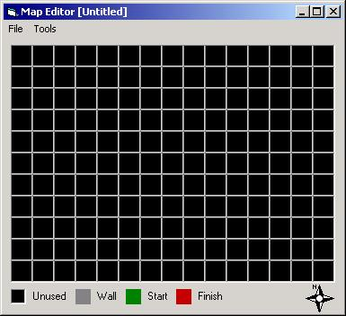



## Binary file overview

### Description

This code is a rather simple program that gives the user a general understanding of creating custom types and manipulating binary files.
 
### More Info
 
There are no input programs for this program.

If you are new to using files and creating file handles, please read through my comments thouroughly. I have explained everything as much as I feel is relevant and I am sure you will find the answers to your most common questions.

If you have the Immediate window open in Visual Basic while the code is executing (and the variable fDebug is set to True) then this program will print any error messages it receives (if any).

There are no side effects that I have noticed when using or coding this program, however if you become aware of any please inform me and I will correct the problem.

             |
---                |---
**Submitted On**   |2002-02-01 23:58:52
**By**             |[Joe Estock](https://github.com/Planet-Source-Code/PSCIndex/blob/master/ByAuthor/joe-estock.md)
**Level**          |Beginner
**User Rating**    |5.0 (50 globes from 10 users)
**Compatibility**  |VB 6\.0
**Category**       |[Complete Applications](https://github.com/Planet-Source-Code/PSCIndex/blob/master/ByCategory/complete-applications__1-27.md)
**World**          |[Visual Basic](https://github.com/Planet-Source-Code/PSCIndex/blob/master/ByWorld/visual-basic.md)
**Archive File**   |[Binary\_fil52375222002\.zip](https://github.com/Planet-Source-Code/joe-estock-binary-file-overview__1-31409/archive/master.zip)

